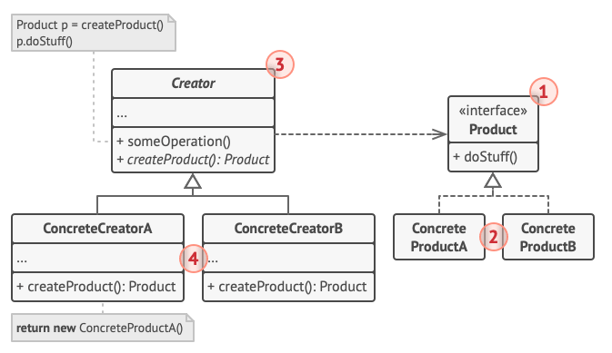

# codewars

This repository contains my solutions to various coding challenges from Codewars. Each solution is organized by its corresponding kata level and programming language. Feel free to explore the solutions, provide feedback, or suggest improvements. Happy coding!

# Design-Patterns

Are typical solutions to recurrent/common problems. When a solution is written over and over, in different projects and scenario, someone eventually grasp the patterns put a name on int and explain it in detail

The Book of the Gand Of Four (GoF): Design Patterns: Elements of Reusable Object-Oriented Software made this concept famous, it was a best seller. The "Design approach", also become famous among others programming paradigms

- Creation patterns provide object creation mechanisms that increase flexibility and reuse of existing code

- Structural patterns explain how to assemble objects and classes into larger structures, while keeping these structures flexible and efficient

- Behavioral patterns take care of effective communication and the assignment of responsibilities between objects

- Creational
  - Factory Method
  - Abstract Factory
  - Builder
  - Prototype
  - Singleton

- Structural
  - Adapter
  - Bridge
  - Composite
  - Decorator
  - Facade
  - Flyweight
  - Proxy

- Behavioral
  - Chain of Responsibility
  - Command
  - Iterator
  - Mediator
  - Memento
  - Observer
  - State
  - Strategy
  - Template Method
  - Visitor

### Creational
 > De forma geral todos os padrões Factory (Simple Factory, Factory Method, Abstract Factory) encapsulam a criação de objetos.

 **Factory Method** is a creational design pattern that provides an interface for creating objects in a superclass, but allows subclasses to alter the type of objects that will be created.

 > No Factory Method há quatro níveis de classes a *factory abstrata*, e as *factorys concretas* que implementam somente o método da classe abstrata que cria a instância da interface principal, toda essa estrutura é criara para facilitar a mudança de comportamento que essa interface carrega
